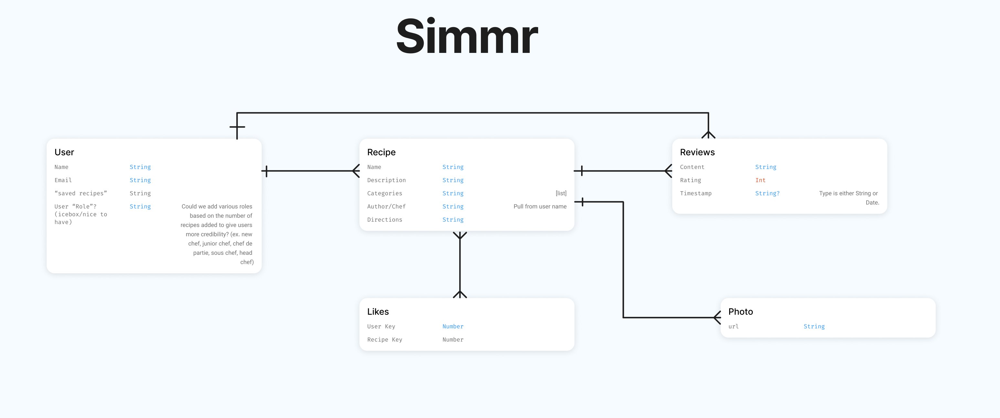
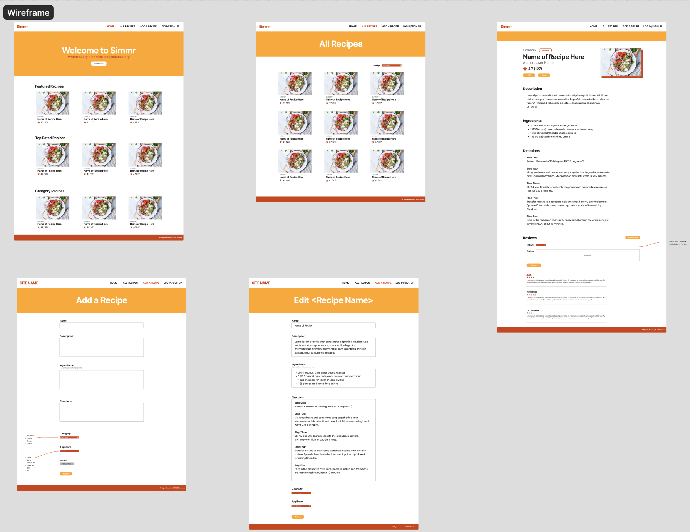

# Simmr App

Simmr is a vibrant online platform where food enthusiasts come together to share, explore, and celebrate the art of cooking. Whether you're a seasoned chef or an aspiring home cook, Simmr provides a welcoming space to showcase your favorite recipes, discover unique culinary creations, and connect with a diverse community of like-minded individuals. From mouth-watering dishes to innovative cooking techniques, Simmr is the go-to destination for all things food, fostering a dynamic and interactive environment where culinary passions thrive.

At Simmr, our goal is to make the joy of cooking accessible to everyone. Through user-friendly features and a visually engaging interface, the platform encourages users to not only share their culinary masterpieces but also embark on a culinary journey by trying out recipes from fellow community members. Simmr is more than just a recipe-sharing site; it's a lively community that celebrates the creativity, diversity, and shared love for food, making every visit a delightful and inspiring experience for food enthusiasts of all levels. Join us in the kitchen, where flavors unite and culinary stories unfold!

## Screenshot(s)

*Include any other relevant screenshots here.*

## Technologies Used

- Python
- Django
- PostgreSQL
- HTML/CSS
- JavaScript
- Heroku (for deployment)
- Amazon S3 (for storing photos)
- Trello (for tracking user stories)
- Figjam (for project planning)

## Getting Started

### Deployed App (Heroku)

[Simmr App on Heroku](https://simmr-a4e862a95079.herokuapp.com/)

### Trello Board

[Trello Board for Project Planning](https://trello.com/b/Ekzu1vwm/sei-recipesuserstories)

## Next Steps

[Pitch Deck for Simmr](https://www.figma.com/file/xVUhb7z5eauyg9qgCkUQgT/Project-Three---ERD-and-Wireframe?type=whiteboard&node-id=0-1&t=MUBsavhcemurAVlO-0)

